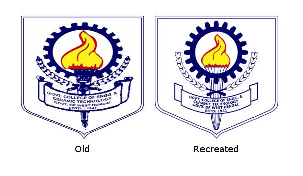

# gcect-logo
This is a remake of the logo of Government College of Engineering and Ceramic Technology, Kolkata, West Bengal, India.

## image sample

## image sample

## files
1. clg-logo.svg: It is Scalable Vector Graphics(SVG) file. If you don't find file with required resolution us this file.

2. clg-logoXXX.png: These are ready to use files. XXX represents the resolution. For example: clg-logo640.png, represents a file of resolution 640x640px.

# License

CC0 1.0 Universal (CC0 1.0) 
Public Domain Dedication

The person who associated a work with this deed has dedicated the work to the public domain by waiving all of his or her rights to the work worldwide under copyright law, including all related and neighboring rights, to the extent allowed by law.

You can copy, modify, distribute and perform the work, even for commercial purposes, all without asking permission. See Other Information below.
